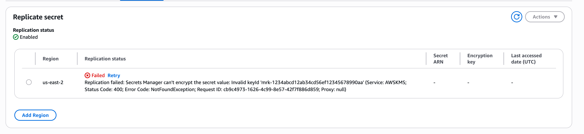

# multi region keys silent error

## Preface

Been working on multi region deployments a bit in 2026. As a result of this I've been working with replicating AWS Secrets Manager secrets across regions. 

You can find more on how multi-region keys work [here](https://docs.aws.amazon.com/kms/latest/developerguide/mrk-how-it-works.html). Essentially in backup and recovery architecture, they allow you to process encrypted data without interruption even during a region outage. In basic terms, data maintained in the backup region can be decrypted in the backup region **and** data newly encrypted in the backup region can be descrypted in the primary region once that region is restored. So Region A fails, you flip traffic to Region B and once Region A is restored the data encrypted during downtime in the backup region can still be descrypted by the original region. 

Now, having worked with AWS for years now the times when something doesn't work as expected are few and far between. It can be easy to think something isn't working as expected __for you__ and quickly think; Ah this must be a bug. However, you think a little bit more and also of the number of users and scale AWS has and usually it's not a bug and you realise you may have been doing something not as it was intended to be done. 

Having said that, I believe I've discovered some unexpected behaviour. At the time of writing, I most likely haven't been the first to discover it but I'll explain below. 

## Secret Replication

Secret replication was launched in [2021](https://aws.amazon.com/about-aws/whats-new/2021/03/aws-secrets-manager-provides-support-to-replicate-secrets-in-aws-secrets-manager-to-multiple-aws-regions/) it allows you to create regional read replicas for secrets, managed by AWS Secrets Manager. Allowing you to access secrets in multiple regions, similar to how I described above with AWS. 

I must preface here, that from my experience with AWS outages, the main services that cause revenue impact are usually CDN or compute based, think EC2, ECS, EKS & Lambda. A scenario is where ECS is impacted in us-east-1 and new tasks cannot be launched due to API errors, it's likely that the Secrets Manager APIs in the same region would be **unaffected** at that time. Although if you're going to implement multi-region and disaster recovery you will want to cover all bases. As the last thing you want is your region switchover to fail due to Secrets Manager API errors across regions during an outage. Replicating secrets allows this issue to be combatted. 


## How to actually do it

For simplicity, I've used my beloved CloudFormation to create a simple Secret in us-east-1 using the following template (note there's no region replication):

```
Resources:
  Secret:
    Type: AWS::SecretsManager::Secret
    Properties:
      Name: MultiRegionTest
      Description: Test MultiRegionSecretWithMrk
      SecretString: TestString
```

After that goes create complete, I've done an update to add [ReplicaRegions](https://docs.aws.amazon.com/AWSCloudFormation/latest/TemplateReference/aws-properties-secretsmanager-secret-replicaregion.html). The only issue is that I don't have any multi region KMS keys in my Account. I've taken `mrk-1234abcd12ab34cd56ef12345678990ab` as the multi-region key from the AWS docs [here](https://docs.aws.amazon.com/kms/latest/developerguide/mrk-how-it-works.html)

```
Resources:
  Secret:
    Type: AWS::SecretsManager::Secret
    Properties:
      Name: MultiRegionTest
      Description: Test MultiRegionSecretWithMrk
      SecretString: TestString
      ReplicaRegions:
        - Region: us-east-2
          KmsKeyId: mrk-1234abcd12ab34cd56ef12345678990ab
```

The surprising result is that the CloudFormation stack Update completes without any issues:


And upon checking the Secrets Manager Console and using the CLI you'll see InProgress set on the Replication:


```
$ aws secretsmanager describe-secret --secret-id MultiRegionTest
[...]
    "PrimaryRegion": "us-east-1",
    "ReplicationStatus": [
        {
            "Region": "us-east-2",
            "KmsKeyId": "mrk-1234abcd12ab34cd56ef12345678990ab",
            "Status": "InProgress"
        }
    ]
}
```

Then after AWS finalises making the [ReplicateSecretToRegions](https://docs.aws.amazon.com/secretsmanager/latest/apireference/API_ReplicateSecretToRegions.html) API calls you'll see a failure:



```
    "ReplicationStatus": [
        {
            "Region": "us-east-2",
            "KmsKeyId": "mrk-1234abcd12ab34cd56ef12345678990ab",
            "Status": "Failed",
            "StatusMessage": "Replication failed: Secrets Manager can't encrypt the secret value: Invalid keyId 'mrk-1234abcd12ab34cd56ef12345678990ab' (Service: AWSKMS; Status Code: 400; Error Code: NotFoundException; Request ID: cb9c4973-1626-4c99-8e57-42f7f886d859; Proxy: null)"
        }
    ]
```

This is not only native to CloudFormation but the same behaviour occurs via any CreateSecret API, for example via CLI:
```
$ aws secretsmanager create-secret --name TestSecretMrkFailure --add-replica-regions Region=us-west-2,KmsKeyId=mrk-1234abcd12ab34cd56ef12345678990aa
{
    "ARN": "arn:aws:secretsmanager:us-east-1:777864510236:secret:TestSecretMrkFailure-4BS2cc",
    "Name": "TestSecretMrkFailure",
    "ReplicationStatus": [
        {
            "Region": "us-west-2",
            "KmsKeyId": "mrk-1234abcd12ab34cd56ef12345678990aa",
            "Status": "InProgress"
        }
    ]
}
```

What's even more strange is that when providing a made up MRK for this secret I get a response that Replication succeeded:

```
$ aws secretsmanager describe-secret --secret-id TestSecretMrkFailure
{
    "ARN": "arn:aws:secretsmanager:us-east-1:777864510236:secret:TestSecretMrkFailure-4BS2cc",
    "Name": "TestSecretMrkFailure",
    "LastChangedDate": "2026-04-22T22:13:45.699000+01:00",
    "CreatedDate": "2026-04-22T22:13:45.687000+01:00",
    "PrimaryRegion": "us-east-1",
    "ReplicationStatus": [
        {
            "Region": "us-west-2",
            "KmsKeyId": "mrk-1234abcd12ab34cd56ef12345678990aa",
            "Status": "InSync",
            "StatusMessage": "Replication succeeded"
        }
    ]
}
```

Upon further testing, upon initial creation the Replication succeeds however the above secret was created with no initial value, when you attempt to update the secret with a Value you will get an error on Replication. I guess that tells us that when `ReplicateSecretToRegions` is called with a `SecretId` additional actions or validation is done on AWS' side. 

As this is an API side issue it would affect all IaC providers too, Terraform, Pulumi, CDK etc. 

## Conclusion

I would expect the Create Operation to fail on validation if an invalid mrk is provided but that doesn't seem to be the case. In fact there looks to be zero validation on the KmsKeyId value at all:

```
$ aws secretsmanager create-secret --name TestSecretMrkFailure4 --add-replica-regions Region=us-west-2,KmsKeyId=MyNameIsDylan$$$$
{
    "ARN": "arn:aws:secretsmanager:us-east-1:777864510236:secret:TestSecretMrkFailure4-6IyW1q",
    "Name": "TestSecretMrkFailure4",
    "ReplicationStatus": [
        {
            "Region": "us-west-2",
            "KmsKeyId": "MyNameIsDylan1610916109",
            "Status": "InProgress"
        }
    ]
}
```
I'll look at ways to combat against this in future posts...

PS: remember to delete these secrets after use, [they're $0.40 per secret per month. A replica secret is considered a distinct secret and will also be billed at $0.40 per replica per month.](https://aws.amazon.com/secrets-manager/pricing/)