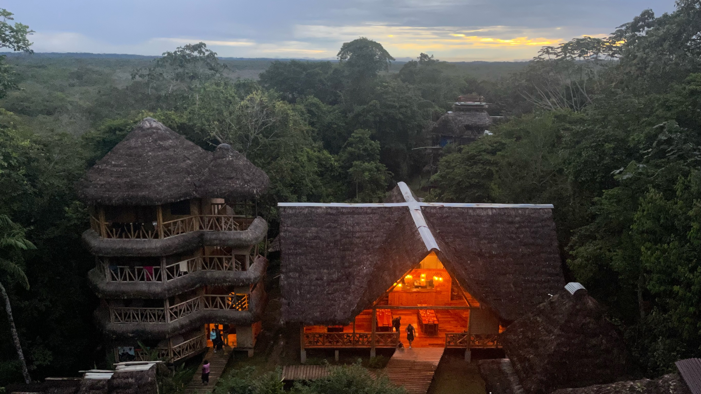
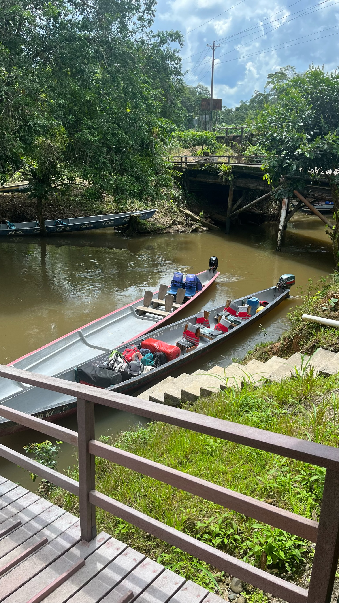

Next stop was Cuyabeno in Ecuador in to the Amazon Rainforest. River offers an unparalleled experience in biodiversity. The Bamboo Eco Lodge provides sustainable accommodations right in the heart of the reserve.

## Day 1: Arrival and Accommodation

- Reached Bamboo Eco Lodge via a flight and subsequent canoe ride.
- The lodge stands amidst dense rainforest, constructed with sustainable materials.
- Participated in a guided night walk to observe nocturnal jungle life.

## Day 2: Activities and Local Interaction

- Morning canoe ride on the Cuyabeno River.
- Observed various wildlife including birds and river dolphins.
- Afternoon visit to a local indigenous community, understanding their customs and traditions.

## Day 3: Exploration and Observation

- Day-long guided jungle trek.
- Identified numerous medicinal plants indigenous to the region.
- Night provided clear skies for stargazing.

## Day 4: Departure

- Leisure morning with a final canoe trip down the river.
- Spent some time relaxing at the lodge before departure.
- Concluded the stay and began the journey back.

## Overview

At 28 years old, this trip provided a comprehensive insight into the Cuyabeno Wildlife Reserve's biodiversity. Bamboo Eco Lodge's location and sustainable approach made the experience both informative and environmentally conscious.
